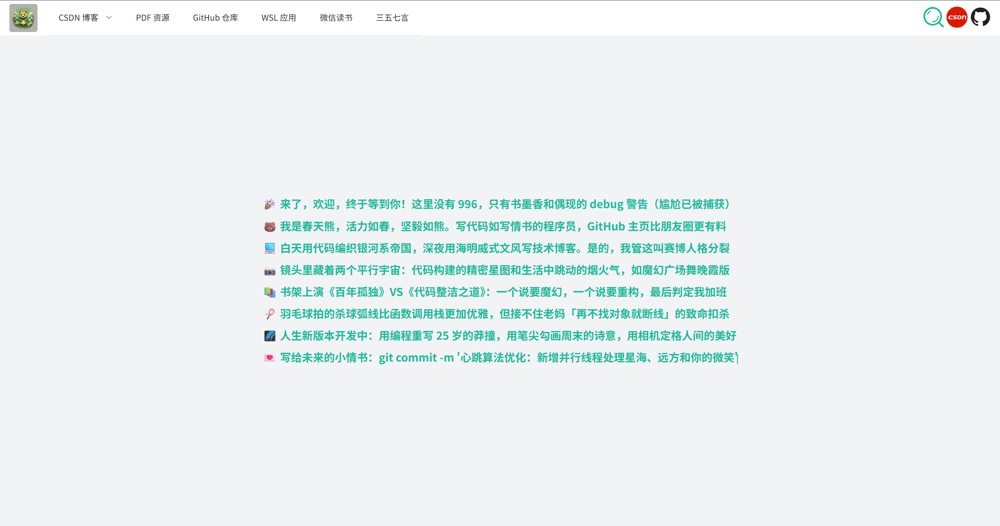
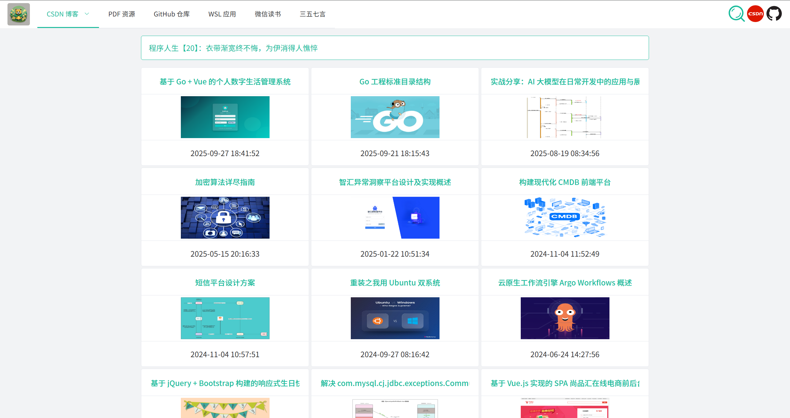
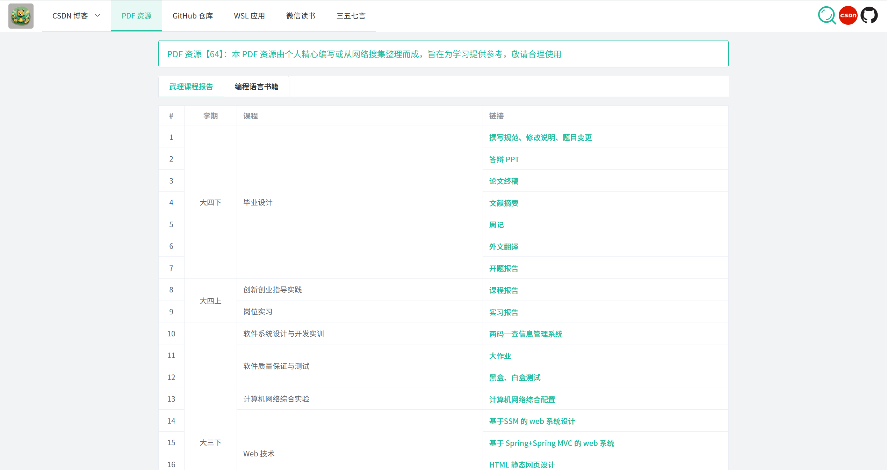
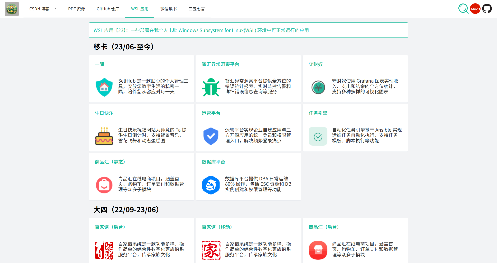
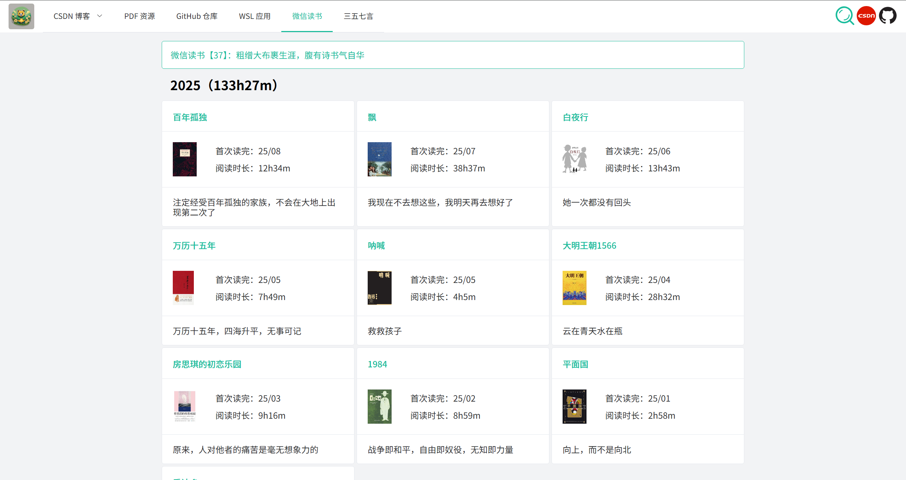
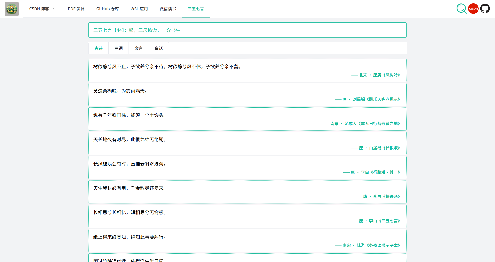
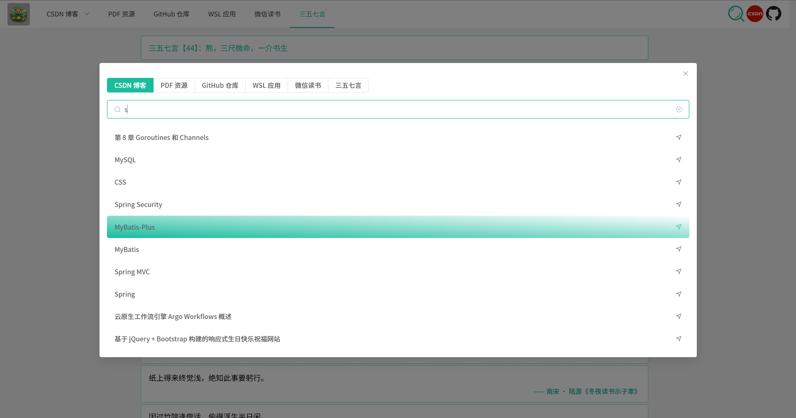

    
    
    
    
    

# Spring-_-Bear's Knowing and Doing

## Greeting Words

## CSDN Blogs

## PDF Resources

## GitHub Repositories

## WSL Applications

## WeRead Books

## Famous Sentences

## Search Anythings

